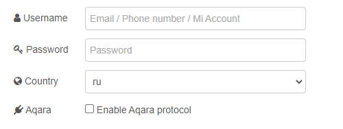

# node-red-contrib-mihome

Add nodes to get data from devices connected to Mi Home using [node-mihome](https://github.com/maxinminax/node-mihome).

## Requirements

* `node` v12.22.0 or higher
* `node-red` v1.3.0 or higher

## Install

Run `npm i node-red-contrib-mihome` in `~/.node-red` directory or search **node-red-contrib-mihome** and install from **Palette Manager**.

## Supported devices

| Device | Model | Tested | Node | Palette name |
| ------ | ----- | ------ | ---- | ------------ |
| Xiaomi Mi Temperature and Humidity Monitor 2 | LYWSD03MMC (China) NUN4126GL (Global, should be checked) | :white_check_mark: | `mihome-th-monitor` | th monitor |

## Adding device support

If you want to add device support, you can make a PR or add request in discussions. Check [supported devices](https://github.com/maxinminax/node-mihome/blob/master/DEVICES.md) in `node-mihome` package and use node [template](nodes/template) for boost development. Additional information you can find in [contributing guide](CONTRIBUTING.md).

## Available nodes

### mihome-cloud

Provide authorization for Mi Home.

#### Settings

| Setting | Required | Description |
| ------- | -------- | ----------- |
| Username | :white_check_mark: | Mi Home account username |
| Password | :white_check_mark: | Mi Home account password |
| Country | :white_check_mark: | Which server use to connect |
| Aqara | :x: | Should it be Aqara protocol  initiated |

##### Setting preview

Aqara protocol limitations: you can set up only one `mihome-cloud` node with Aqara protocol enabled, all another may cause errors (in short explanation it's because `node-mihome` open socket connection in exclusive mode).

### mihome-devices

Returns all devices connected to Mi Home.

Palette name: devices.

#### Statuses

| Statuses | Preview |
| -------- | ------- |
| Node not connected to cloud |  |
| Node connected to cloud |  |

#### Settings

| Setting | Required | Description |
| ------- | -------- | ----------- |
| Cloud | :white_check_mark: | Mi Home account settings |
| Name | :x: | Node display name |

##### Setting preview

#### Setup

|     | Description |
| --- | ----------- |
| **Input** | `payload` with `true` value |
| **Output** | `payload` as array of objects |

### mihome-th-monitor

Returns climate data.

Palette name: th monitor.

#### Statuses

| Statuses | Preview |
| -------- | ------- |
| Node not connected to cloud |  |
| Node connected to cloud but not configured |  |
| Node connected to cloud and configured |  |

#### Settings

| Setting | Required | Description |
| ------- | -------- | ----------- |
| Cloud | :white_check_mark: | Mi Home account settings |
| Device ID | :white_check_mark: | Unique device ID from Mi Home, you can get it by checking `did` field from `mihome-devices` output |
| Name | :x: | Node display name |

##### Setting preview

#### Setup

|     | Description                   |
| --- | ----------------------------- |
| **Input** | `payload` with `true` value |
| **Output** | `payload` as object contains temperature, humidity, battery level (could be null) and timestamps |
